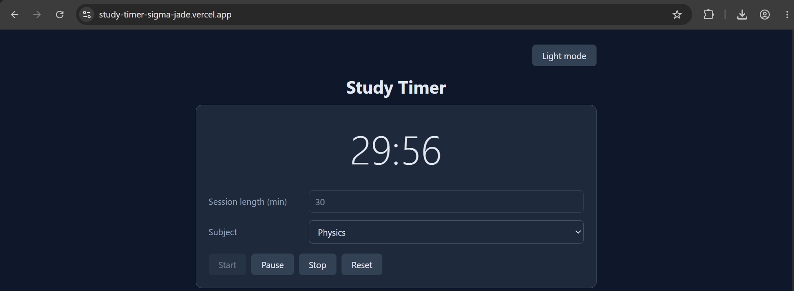
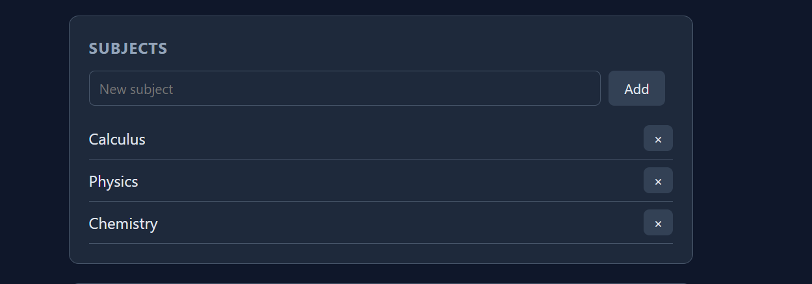
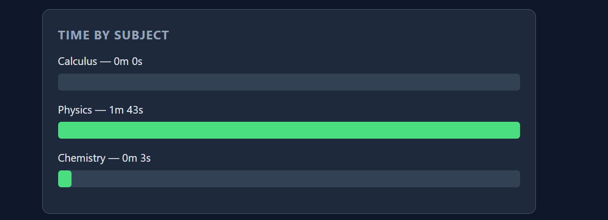
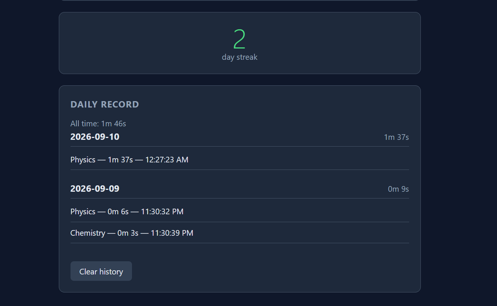

# Study Timer

A React single-page application for tracking study time by subject.

**Live demo:** https://study-timer-sigma-jade.vercel.app/

## Demo video
https://github.com/user-attachments/assets/1d31929e-e602-4bd5-99ba-770d2e0c3a5f
Also available directly in the repo: [demo.mp4](demo.mp4)

## Screenshots

### Timer


### Subject management


### Time per subject


### Daily record


## Features
- Countdown timer with start, pause, stop and reset
- Configurable session length, defaulting to 25 minutes
- User-managed subject list with add and remove, guarded by a confirmation dialog
- Sessions logged on stop or on natural completion; reset discards instead
- Daily record grouping sessions by date with per-day totals
- Bar chart of total time per subject, built without a charting library
- Consecutive-day streak counter
- Light and dark themes
- All data persisted in localStorage

## Setup

Requires Node.js 18 or later.

```bash
git clone https://github.com/shibasischatterjee1208/study-timer.git
cd study-timer
npm install
npm run dev
```

Open the URL printed in the terminal, usually http://localhost:5173.

To build for production:

```bash
npm run build
npm run preview
```

## Usage
1. Pick a subject from the dropdown. Start stays disabled until one is chosen.
2. Set a session length in minutes, or leave the default of 25.
3. Press Start. Pause and resume freely.
4. Press Stop to end early and log the elapsed time, or let it run to zero.
5. Reset clears the clock without logging.
6. Add or remove subjects in the Subjects panel.

## Implementation

**Structure.** `App.jsx` holds all application state and handlers. The six components in `components/` are display-only: they receive props and call callbacks upward. State is centralised in `App` because sibling components share it — `subjects` is used by both the timer's dropdown and the subject manager.

**The countdown** runs in a `useEffect` with `[status]` as its dependency. When status changes, React runs the cleanup to clear the existing interval before re-running the effect, so intervals are created and destroyed automatically rather than being managed by hand. The interval uses the functional state update `s => s - 1` so it reads the current value rather than one captured when the effect ran.

**Derived values** such as per-subject totals, daily groupings and the streak are computed during render rather than stored in state, so they cannot fall out of sync with the sessions they come from.

**Persistence** uses two effects that write to localStorage when subjects or sessions change, with lazy initialisers on `useState` to read the saved values on first render.

## React concepts used
- `useState`, including lazy initialisers
- `useEffect` with cleanup, for intervals and for storage
- Lifting state up
- Props and one-way data flow
- Conditional rendering
- List rendering with keys
- Controlled inputs
- Derived state

## Known limitations
- `setInterval` drifts and throttles in background tabs, so logged time is approximate. Computing elapsed time from a stored timestamp would be more accurate.
- localStorage is per-browser, so data does not sync across devices. This would need a backend.
- Sessions belonging to a deleted subject still count toward the all-time total but no longer appear in the chart.

## Built with
React 18, Vite, plain CSS. No UI or charting libraries.